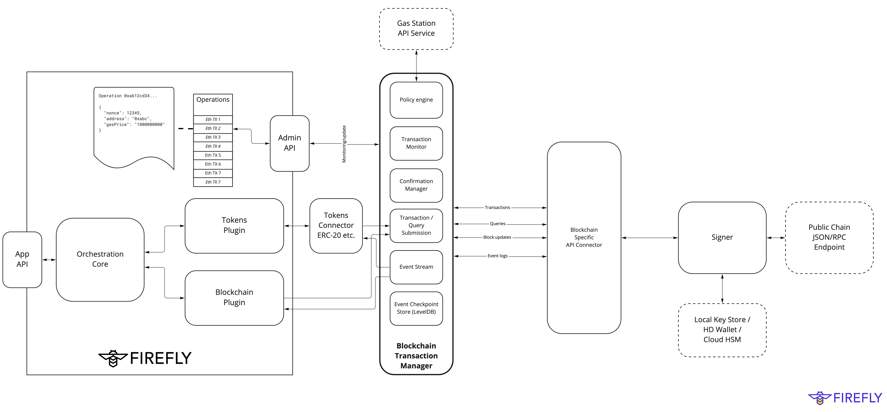

 

# Hyperledger FireFly Transaction Manager

Plugable microservice component of Hyperledger FireFly, responsible for:

- Submission of transactions to blockchains of all types
  - Protocol connectivity decoupled with additional lightweight API connector
  - Easy to add additional protocols that conform to normal patterns of TX submission / events

- Monitoring and updating blockchain operations
  - Receipts
  - Confirmations

- Gas calculation and rescue of stalled transactions
  - Extensible policy engine
  - Gas station API integration

- Event streaming [* work in progress to extract from previous location in ethconnect]
  - Protocol agnostic event polling/streaming support
  - Reliable checkpoint restart
  - At least once delivery API

