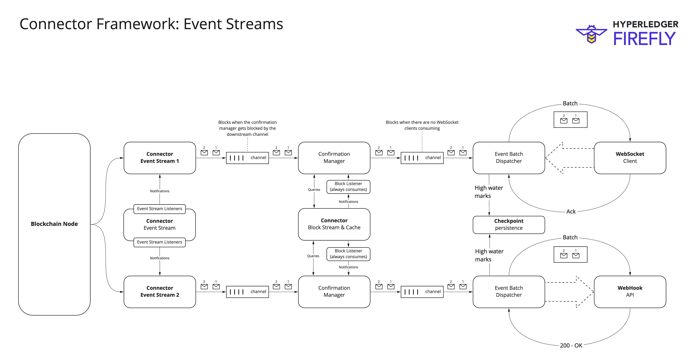

[](https://codecov.io/gh/hyperledger/firefly-transaction-manager) [](https://pkg.go.dev/github.com/hyperledger/firefly-transaction-manager)

# Hyperledger FireFly Transaction Manager

The core component of the FireFly Connector Framework for Blockchains, responsible for:

- Submission of transactions to blockchains of all types
  - Protocol connectivity decoupled with additional lightweight API connector
  - Easy to add additional protocols that conform to normal patterns of TX submission / events

- Monitoring and updating blockchain operations
  - Receipts
  - Confirmations

- Extensible transaction handler with capabilities such as:
  - Nonce management: idempotent submission of transactions, and assignment of nonces 
  - Transaction management: pre-signing transactions, resubmission, customizable policy engine
  - Gas management: Gas Gas station API integration
  - Transaction process history

- Event streaming
  - Protocol agnostic event polling/streaming support
  - Reliable checkpoint restart
  - At least once delivery API

## Architecture

The core architecture of the FireFly Connector Framework is as follows:

[](./images/firefly_connector_framework_architecture.jpg)

This re-usable codebase contains as much as possible of the re-usable heavy lifting code needed across any blockchain.

The framework is currently constrained to blockchains that adhere to certain basic principals:

1. Has transactions
  - That are signed
  - That can optionally have gas semantics (limits and prices, expressed in a blockchain specific way)
2. Has events (or "logs")
  - That are emitted as a deterministic outcome of transactions
3. Has blocks
  - Containing zero or more transactions, with their associated events
  - With a sequential numeric order
  - With a hash
  - With a parent hash
4. Has finality for transactions & events that can be expressed as a level of confidence over time
  - Confirmations: A number of sequential blocks in the canonical chain that contain the transaction

## Developer setup

To run the postgres tests, you need to have a local database started as follows:

```bash
docker run -d --name postgres -e POSTGRES_PASSWORD=f1refly -p 5432:5432 postgres
```

## Nonce management in the simple transaction handler

The nonces for transactions is assigned as early as possible in the flow:
- Before the REST API for submission of the transaction occurs
- After the FFCAPI blockchain connector verifies the transaction can be encoded successfully to the chain
- With protection against multiple parallel API requests for the same signing address
- With stateful persistence meaning the connector knows about all nonces it previously allocated, to avoids duplicates

This "at source" allocation of nonces provides the strictest assurance of order of transactions possible,
because the order is locked in with the coordination of the business logic of the application submitting the transaction.

As well as protecting against loss of transactions, this protects against duplication of transactions - even in crash
recovery scenarios with a sufficiently reliable persistence layer.

### Avoid multiple nonce management systems against the same signing key

FFTM is optimized for cases where all transactions for a given signing address flow through the
same FireFly connector. If you have signing and nonce allocation happening elsewhere, not going through the
FireFly blockchain connector, then it is possible that the same nonce will be allocated in two places.

> Be careful that the signing keys for transactions you stream through the Nonce Management of the FireFly
> blockchain connector are not used elsewhere.

If you must have multiple systems performing nonce management against the same keys you use with FireFly nonce management,
you can set the `transactions.nonceStateTimeout` to `0` (or a low threshold like `100ms`) to cause the nonce management
to query the pending transaction pool of the node every time a nonce is allocated.

This reduces the window for concurrent nonce allocation to be small (basically the same as if you had
multiple simple web/mobile wallets used against the same key), but it does not eliminate it completely it.

### Why "at source" nonce management was chosen vs. "at target"

The "at source" approach to ordering used in FFTM could be compared with the "at target" allocation of nonces used in
[EthConnect](https://github.com/hyperledger/firefly-ethconnect)).

The "at target" approach optimizes for throughput and ability to send new transactions to the chain,
with an at-least-once delivery assurance to the applications.

An "at target" algorithm as used in EthConnect could resume transaction delivery automatically without operator intervention
from almost all scenarios, including where nonces have been double allocated.

However, "at target" comes with two compromises that mean FFTM chose the "at source" approach was chosen for FFTM:

- Individual transactions might fail in certain scenarios, and subsequent transactions will still be streamed to the chain.
  While desirable for automation and throughput, this reduces the ordering guarantee for high value transactions.

- In crash recovery scenarios the assurance is at-least-once delivery for "at target" ordering (rather than "exactly once"),
  although the window can be made very small through various optimizations included in the EthConnect codebase.

## Transaction Handler

A simple transaction handler can be found in [./pkg/txhandler/simple](./pkg/txhandler/simple). You can write your own transaction
handler using [the transaction handler interface](./pkg/txhandler/txhandler.go).

An example of how to plug in your handler, can be found [here](https://github.com/hyperledger/firefly-evmconnect/blob/a4b3b15dc4fa1ac93ad9f829d23e4574a4c71f01/cmd/evmconnect.go#L66)

## Event streaming

One of the most sophisticated parts of the FireFly Connector Framework is the handling of event streams.

> TODO: More detail to back up this diagram.

[](./images/fftm_event_streams_architecture.jpg)

Example Grafana dashboard for event processing metrics: [./grafana_dash/Event process metrics-1717595375618.json](./grafana_dash/Event%20process%20metrics-1717595375618.json)

# Persistence

Simple filesystem (LevelDB) or remote database (PostgreSQL) persistence is supported.

The SQL based persistence implementation includes some additional features, including:
- Flush-writers for transaction persistence, to optimize database commits when writing new transactions in parallel
- Rich query support on the API

# Configuration

See [config.md](./config.md)
